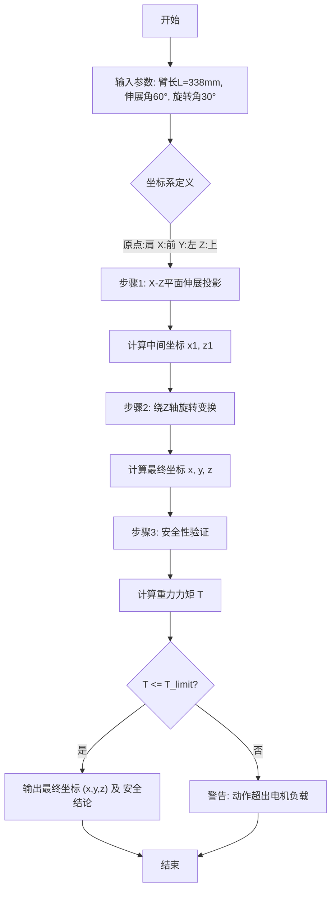

# 小问 1：空间直角坐标系转换模型

## 1. 变量定义

| 变量符号 | 变量名称 | 变量类型 | 单位 | 取值范围/备注 |
| :--- | :--- | :--- | :--- | :--- |
| $L_{arm}$ | 左臂长度 | 已知参数 | mm | 338 |
| $\theta_{ext}$ | 伸展角度 | 决策变量 | 度 (°) | $60^\circ$ (题目给定) |
| $\theta_{rot}$ | 旋转角度 | 决策变量 | 度 (°) | $30^\circ$ (题目给定) |
| $P_0$ | 肩关节坐标原点 | 参考点 | - | $(0, 0, 0)$ |
| $P_1$ | 伸展后末端坐标 | 中间变量 | mm | $(x_1, y_1, z_1)$ |
| $P_{final}$ | 最终手部端点坐标 | 目标变量 | mm | $(x, y, z)$ |
| $T_{motor}$ | 电机需求扭矩 | 中间变量 | N·m | $\ge 0$ |
| $T_{limit}$ | 电机安全阈值 | 约束参数 | N·m | 参考同类机器人参数 |
| $F_{load}$ | 手臂重力/惯性力 | 中间变量 | N | 取决于手臂质量分布 |

## 2. 假设条件

1.  **刚体假设**：假设机器人手臂为刚体，忽略运动过程中的弹性形变和震动对端点坐标的影响。
    *   *合理性*：机器人手臂材料刚度通常较高，且题目未提供材料弹性模量，微小形变对宏观坐标影响可忽略。
2.  **理想关节假设**：假设关节旋转轴严格正交，且旋转中心重合于肩部原点，忽略机械间隙和装配误差。
    *   *合理性*：简化几何建模复杂度，便于建立标准坐标变换方程。
3.  **坐标系定义假设**：依据题目描述，建立局部坐标系：原点为肩关节，X轴指向正前方，Y轴指向正左方，Z轴垂直向上。
    *   *合理性*：符合题目中“前/左/上”的方位描述，便于直观投影计算。
4.  **分步运动假设**：将复合运动分解为先伸展后旋转的独立过程，且假设旋转顺序对最终位置无耦合干扰（基于题目“正交分解”的逻辑）。
    *   *合理性*：题目给出的正交分解逻辑暗示了这种解耦处理方式。
5.  **静态力矩假设**：在验证电机扭矩时，主要考虑重力产生的静力矩，忽略瞬时角加速度引起的动力矩。
    *   *合理性*：在仅给定最终状态角度而未给定运动时间/速度曲线的情况下，静态安全验证是必要的底线。

## 3. 公式推导

### 3.1 坐标系建立与初始状态
设定肩关节中心为原点 $O(0,0,0)$。
*   X轴：水平向前
*   Y轴：水平向左
*   Z轴：垂直向上

### 3.2 动作正交分解与坐标变换

**步骤一：X-Z平面伸展运动（Pitch）**
手臂在 X-Z 平面内向上抬起 $\theta_{ext} = 60^\circ$。此时，手臂在 Y 轴方向无位移。
根据三角函数投影关系：
$$
\begin{cases}
x_1 = L_{arm} \cdot \cos(\theta_{ext}) \\
z_1 = L_{arm} \cdot \sin(\theta_{ext}) \\
y_1 = 0
\end{cases}
$$
代入数值 $L_{arm}=338, \theta_{ext}=60^\circ$：
$$
x_1 = 338 \cdot \cos(60^\circ) = 169 \\
z_1 = 338 \cdot \sin(60^\circ) \approx 292.72
$$

**步骤二：绕 Z 轴（或等效垂直轴）旋转运动（Yaw）**
题目描述“向左侧转动 30°”，且“仅影响 x、y 坐标，z 不受影响”。这对应于绕 Z 轴旋转 $\theta_{rot} = 30^\circ$。
在此变换中，步骤一得到的 $x_1$ 作为旋转半径在 X-Y 平面内投影。
$$
\begin{cases}
x = x_1 \cdot \cos(\theta_{rot}) - y_1 \cdot \sin(\theta_{rot}) \\
y = x_1 \cdot \sin(\theta_{rot}) + y_1 \cdot \cos(\theta_{rot}) \\
z = z_1
\end{cases}
$$
由于 $y_1=0$，公式简化为：
$$
\begin{cases}
x = x_1 \cdot \cos(30^\circ) \\
y = x_1 \cdot \sin(30^\circ) \\
z = z_1
\end{cases}
$$

### 3.3 综合坐标公式
将步骤一结果代入步骤二，得到最终坐标 $(x, y, z)$ 关于 $L, \theta_{ext}, \theta_{rot}$ 的通式：
$$
\begin{bmatrix} x \\ y \\ z \end{bmatrix} = L_{arm} \cdot \begin{bmatrix} \cos\theta_{ext} \cos\theta_{rot} \\ \cos\theta_{ext} \sin\theta_{rot} \\ \sin\theta_{ext} \end{bmatrix}
$$

### 3.4 电机扭矩安全验证模型
为了验证该动作是否在电机能力范围内，计算重力产生的力矩。
假设手臂质心位于几何中心 $L_c = L_{arm}/2$，手臂质量为 $m$。
力臂在水平面上的投影长度 $d_{horiz}$：
$$
d_{horiz} = \frac{L_{arm}}{2} \cdot \cos(\theta_{ext})
$$
重力产生的力矩 $T_{gravity}$：
$$
T_{gravity} = m \cdot g \cdot d_{horiz} = m \cdot g \cdot \frac{L_{arm}}{2} \cdot \cos(60^\circ)
$$
安全判据：
$$
T_{gravity} \le T_{limit}
$$
若满足该不等式，则动作在力学上是安全的。

## 4. 建模流程图

