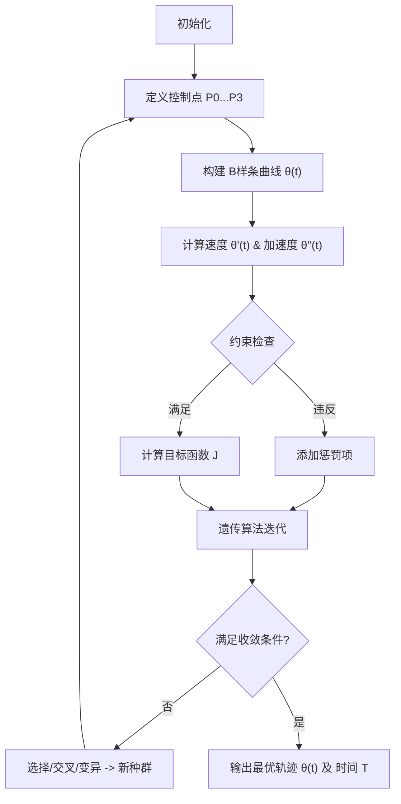

# 小问 2：B 样条曲线 + 动力学约束轨迹优化模型

## 1. 变量定义

| 变量符号 | 变量名称 | 变量类型 | 单位 | 取值范围/备注 |
| :--- | :--- | :--- | :--- | :--- |
| $t$ | 时间 | 自变量 | s | $[0, T]$ |
| $T$ | 总运动时间 | 决策变量 | s | $T > 0$ |
| $P_i$ | B样条控制点 | 决策变量 | - | $i=0,1,2,3$ |
| $\theta(t)$ | 膝关节角度 | 状态变量 | 度 (°) | 连续函数 |
| $\dot{\theta}(t)$ | 关节角速度 | 中间变量 | °/s | $[-10, 10]$ (约束) |
| $\ddot{\theta}(t)$ | 关节角加速度 | 中间变量 | °/s² | - |
| $\tau(t)$ | 关节力矩 | 中间变量 | N·m | $[-8, 8]$ (约束) |
| $S_{total}$ | 总运动距离 | 已知参数 | m | 10 |
| $v_{avg}$ | 平均速度 | 已知参数 | m/s | 2 |
| $U$ | 节点向量 | 参数 | - | Uniform B-Spline |
| $N_{i,p}(t)$ | B样条基函数 | 函数 | - | 3次 (p=3) |

## 2. 假设条件

1.  **平滑运动假设**：假设机器人关节运动轨迹是连续且三阶可导的，以保证运动平滑无突变，故选用3次B样条曲线建模。
    *   *合理性*：高阶连续性有助于减少机械磨损和控制系统的震荡。
2.  **各向同性假设**：假设环境地面平整，忽略地面摩擦系数变化对运动轨迹规划的影响。
    *   *合理性*：题目侧重于关节轨迹规划，环境因素简化处理。
3.  **简化动力学假设**：在计算力矩限制时，主要考虑关节驱动力矩，忽略连杆之间的高阶耦合项（如科里奥利力）对单关节优化的影响。
    *   *合理性*：在初步轨迹规划阶段，简化动力学模型可大幅提高计算效率，且误差可通过后续控制回路补偿。
4.  **对称性假设**：假设机器人双腿运动具有周期性和对称性，单腿规划结果可通过相位差应用于另一条腿。
    *   *合理性*：人形机器人步态通常是对称的。
5.  **刚性连接假设**：忽略传动系统的弹性，认为电机输出直接作用于关节。

## 3. 公式推导

### 3.1 B样条曲线模型
采用 3 次 B 样条曲线描述膝关节角度 $\theta(t)$。
$$
\theta(u) = \sum_{i=0}^{n} P_i N_{i,3}(u)
$$
其中：
*   $P_i$ 为控制点，对应时间节点 $t_0, t_1, t_2, t_3$。
*   $N_{i,3}(u)$ 为 3 次 B 样条基函数，由 Cox-de Boor 递归公式定义：
    $$
    N_{i,0}(u) = \begin{cases} 1, & u_i \le u < u_{i+1} \\ 0, & \text{otherwise} \end{cases}
    $$
    $$
    N_{i,p}(u) = \frac{u - u_i}{u_{i+p} - u_i} N_{i,p-1}(u) + \frac{u_{i+p+1} - u}{u_{i+p+1} - u_{i+1}} N_{i+1,p-1}(u)
    $$
    在此模型中，时间 $t$ 归一化为参数 $u \in [0, 1]$。

### 3.2 运动学与动力学约束
1.  **角速度约束**：
    对 $\theta(t)$ 求导得到角速度 $\dot{\theta}(t)$，需满足：
    $$
    |\dot{\theta}(t)| \le 10^\circ/s, \quad \forall t \in [0, T]
    $$
2.  **力矩约束**：
    根据简化的动力学方程 $ \tau = J \ddot{\theta} + B \dot{\theta} + G(\theta) $（此处重点关注极值），题目给定直接约束：
    $$
    |\tau(t)| \le 8 \text{ N·m}
    $$
3.  **边界条件**：
    *   起点：$\theta(0) = \theta_{start}$
    *   终点：$\theta(T) = \theta_{end}$
    *   平均速度隐含约束：$S_{total} / T \approx v_{avg}$ (题目给定平均速度2m/s，距离10m，则 $T \approx 5s$)。此处 $T$ 可作为在 5s 附近微调的优化变量。

### 3.3 优化模型
**目标函数**：
为了减少运动冲击，选择最小化角速度变化率（即角加速度的某种范数，或题目提到的“最小化膝关节角度变化率”的积分）：
$$
\text{Minimize } J = \int_{0}^{T} |\dot{\theta}(t)| dt \quad \text{或} \quad \int_{0}^{T} (\ddot{\theta}(t))^2 dt
$$
*注：根据题目分析文件，目标选定为最小化角速度绝对值积分，即总角行程最小化，或平滑度最优。此处采用平滑度公式。*

**约束集合**：
$$
s.t. \begin{cases}
|\dot{\theta}(t)| \le 10 \\
|\tau(t)| \le 8 \\
T \approx 5 \\
\theta(0) = 0, \theta(T) = \theta_{target}
\end{cases}
$$

### 3.4 遗传算法 (GA) 求解设计
*   **编码**：染色体 $C = \{\theta_1, \theta_2, T\}$，代表中间两个控制点的角度值和总时间。
*   **适应度函数**：
    $$
    Fitness = \frac{1}{J + w_1 \cdot P_{vel} + w_2 \cdot P_{torque}}
    $$
    其中 $P_{vel}, P_{torque}$ 为超出约束的惩罚项。
*   **算子**：
    *   选择：轮盘赌选择法
    *   交叉：算术交叉
    *   变异：高斯变异

## 4. 建模流程图

