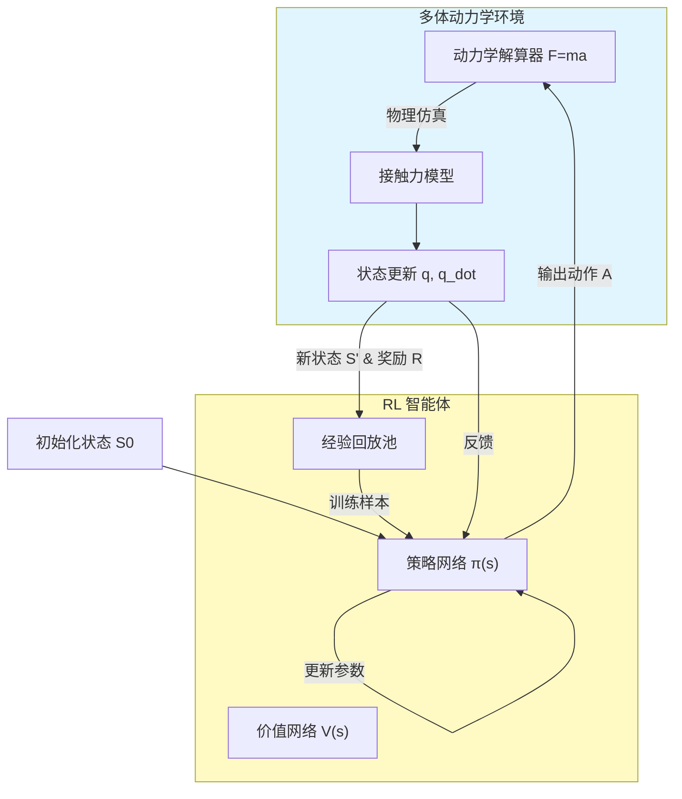

# 小问 3：多体动力学 + 强化学习协同控制模型

## 1. 变量定义

| 变量符号 | 变量名称 | 变量类型 | 单位 | 取值范围/备注 |
| :--- | :--- | :--- | :--- | :--- |
| $S_t$ | 状态向量 | 输入变量 | - | 维度 30+ |
| $A_t$ | 动作向量 | 决策变量 | 度 (°) | 维度 11 (关节调整量) |
| $R_t$ | 奖励值 | 目标变量 | - | 标量 |
| $q_i, \dot{q}_i$ | 关节 $i$ 角度/角速度 | 状态分量 | rad, rad/s | - |
| $P_{CoM}$ | 身体重心坐标 | 状态分量 | m | $(x_g, y_g, z_g)$ |
| $\tau_i$ | 关节力矩 | 物理量 | N·m | 由动力学反解 |
| $\Delta G$ | 重心偏移量 | 中间变量 | m | $|P_{CoM} - P_{target}|$ |
| $\theta_{target}$ | 目标轨迹角度 | 参考量 | rad | 来自小问1/2 |

## 2. 假设条件

1.  **环境简化假设**：假设地面为刚性且摩擦系数恒定（库伦摩擦模型），忽略地面微观形变。
    *   *合理性*：标准物理引擎通用设定，减少接触力解算的复杂度。
2.  **时间离散假设**：将连续时间的物理过程离散化为固定时间步长（如 $\Delta t = 0.01s$）的决策过程。
    *   *合理性*：符合强化学习（RL）马尔可夫决策过程（MDP）的框架要求。
3.  **关节驱动响应假设**：假设关节电机能瞬间响应指令给定的角度或力矩变化，忽略电机电感延迟。
    *   *合理性*：控制指令周期通常远大于电机电气常数，可视为瞬态响应。
4.  **无外界干扰假设**：假设训练和运行环境中无风力、外力推搡等随机干扰。
    *   *合理性*：聚焦于机器人自身的协同控制能力。

## 3. 公式推导

### 3.1 多体动力学方程
将机器人视为由 11 个刚体组成的系统（躯干+2×上臂+2×前臂+2×大腿+2×小腿+2×脚）。
基于拉格朗日法建立动力学方程：
$$
\frac{d}{dt} \left( \frac{\partial L}{\partial \dot{q}} \right) - \frac{\partial L}{\partial q} = \tau - J^T F_{ext}
$$
其中：
*   $q$：广义坐标（各关节角度）
*   $L = T_{kin} - V_{pot}$：拉格朗日量（动能 - 势能）
*   $\tau$：关节驱动力矩
*   $F_{ext}$：外部接触力（地面反作用力）

### 3.2 强化学习 (DQN/PPO) 框架

**状态空间 (State Space)**
$$
S_t = \{ q_1, \dots, q_{11}, \dot{q}_1, \dots, \dot{q}_{11}, P_{CoM}, v_{CoM}, \text{contact}_{feet} \}
$$
包含所有关节的角度、角速度、整体重心位置及速度、足端接触状态。

**动作空间 (Action Space)**
$$
A_t = \{ \Delta \theta_1, \dots, \Delta \theta_{11} \}
$$
动作为各关节目标角度的增量，范围限制在 $[-2^\circ, +2^\circ]$ 之间，以保证动作平滑。

**奖励函数 (Reward Function)**
设计奖励函数引导机器人保持平衡并完成动作：
$$
R_t = w_1 \cdot R_{survive} - w_2 \cdot |\Delta G| - w_3 \cdot \sum \| \theta_t - \theta_{ref} \|^2
$$
*   $R_{survive}$：存活奖励（未摔倒则给正分，如 +1）。
*   $|\Delta G|$：重心偏移惩罚，要求重心保持在支撑域内。
*   $\| \theta_t - \theta_{ref} \|$：轨迹跟踪误差惩罚，$\theta_{ref}$ 为小问1、2规划的理想轨迹。

### 3.3 协同控制策略
利用深度神经网络近似 Q 值函数（DQN）或 策略函数（PPO）：
$$
\pi^*(S_t) = \arg\max_a Q(S_t, a; \Theta)
$$
网络结构：
*   Input: 30+ 维状态
*   Hidden: 256 x 2 全连接层 (ReLU)
*   Output: 11 维动作值

## 4. 建模流程图

