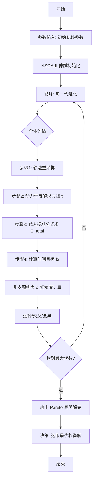

# 小问 4：电机损耗模型 + 多目标遗传算法优化

## 1. 变量定义

| 变量符号 | 变量名称 | 变量类型 | 单位 | 取值范围/备注 |
| :--- | :--- | :--- | :--- | :--- |
| $E_{total}$ | 总能耗 | 目标变量 (min) | J | - |
| $T_{max\_cycle}$ | 最大动作周期 | 目标变量 (min) | s | - |
| $\omega_1$ | 小问1伸展速度 | 优化变量 | °/s | $\le 5$ |
| $T_2$ | 小问2运动时间 | 优化变量 | s | $\le 6$ |
| $\omega_3$ | 小问3画圆角速度 | 优化变量 | rad/s | $\le 10^\circ/s$ |
| $P_{Cu}$ | 铜损功率 | 中间变量 | W | - |
| $P_{Fe}$ | 铁损功率 | 中间变量 | W | - |
| $P_{mech}$ | 机械损耗功率 | 中间变量 | W | - |
| $I(t)$ | 电机电流 | 中间变量 | A | - |
| $R$ | 电机绕组电阻 | 参数 | $\Omega$ | 已知常数 |
| $K_t$ | 转矩常数 | 参数 | N·m/A | 已知常数 |

## 2. 假设条件

1.  **热稳态假设**：假设电机在运行过程中温度保持恒定，忽略温度变化对电阻 $R$ 和磁路特性的影响。
    *   *合理性*：动作时间较短，温升效应不显著。
2.  **参数解耦假设**：假设铜损、铁损、机械损耗相互独立，总损耗为三者线性叠加。
    *   *合理性*：工程上常用的电机损耗估算模型，误差在可接受范围内。
3.  **电源理想假设**：假设电池电压恒定为 67.2V，内阻忽略不计。
    *   *合理性*：电池容量较大 (15Ah)，短时间放电电压降较小。
4.  **轨迹缩放假设**：假设改变动作速度（如 $\omega_1$）仅改变时间轴的缩放，动作的空间轨迹保持不变。
    *   *合理性*：简化优化变量，避免重新进行复杂的轨迹规划。

## 3. 公式推导

### 3.1 电机瞬时功率模型
对于每一个关节电机，瞬时总输入功率 $P_{in}(t)$ 由输出机械功率和内部损耗组成：
$$
P_{in}(t) = P_{out}(t) + P_{loss}(t)
$$
其中：
1.  **机械输出功率**：
    $$
    P_{out}(t) = \tau(t) \cdot \omega(t)
    $$
2.  **铜损 (Copper Loss)**：
    $$
    P_{Cu}(t) = I(t)^2 R = \left( \frac{\tau(t)}{K_t} \right)^2 R
    $$
3.  **铁损 (Iron Loss)**：
    通常与转速的高次幂相关，根据题目模型：
    $$
    P_{Fe}(t) = k_3 \cdot \omega(t)^4
    $$
4.  **机械摩擦损耗**：
    $$
    P_{mech}(t) = k_2 \cdot \omega(t)
    $$

### 3.2 总能耗模型
对所有 $N$ 个关节在时间 $T$ 内积分求和：
$$
E_{total} = \sum_{j=1}^{N} \int_{0}^{T} \left( \tau_j(t)\omega_j(t) + \frac{\tau_j(t)^2 R}{K_t^2} + k_3 \omega_j(t)^4 + k_2 \omega_j(t) \right) dt
$$

### 3.3 多目标优化模型 (NSGA-II)

**优化变量**：
$$
X = [\omega_1, T_2, \omega_3]
$$

**目标函数**：
$$
\begin{cases}
\min f_1(X) = E_{total}(X) & \text{(能耗最小)} \\
\min f_2(X) = \max(T_1, T_2, T_3) & \text{(最大周期最小/效率最高)}
\end{cases}
$$

**约束条件**：
$$
s.t. \begin{cases}
\omega_1 \le 5^\circ/s \\
T_2 \le 6s \\
\omega_3 \le 10^\circ/s \\
\text{Error}_{traj} \le 2\% \text{ (轨迹跟踪误差)}
\end{cases}
$$

### 3.4 求解步骤
1.  **初始化**：生成包含 $N_{pop}$ 个个体的种群，每个个体对应一组 $(\omega_1, T_2, \omega_3)$。
2.  **评估**：将个体参数代入动力学模型，计算 $E_{total}$ 和 时间 $T$。
3.  **非支配排序 (Non-dominated Sorting)**：根据 $f_1, f_2$ 确定个体的帕累托等级。
4.  **拥挤度计算**：在同一等级内计算拥挤距离，保持多样性。
5.  **进化**：通过选择、交叉、变异生成子代。
6.  **收敛**：迭代达到预设代数，输出 Pareto 前沿。

## 4. 建模流程图

